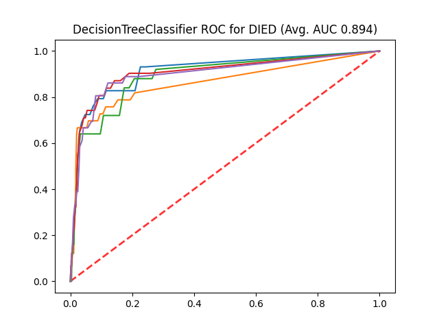
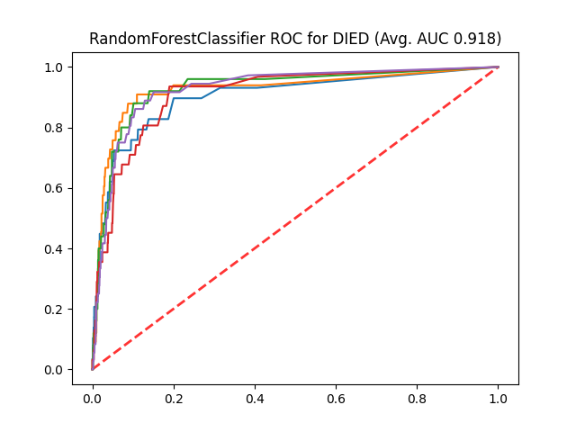
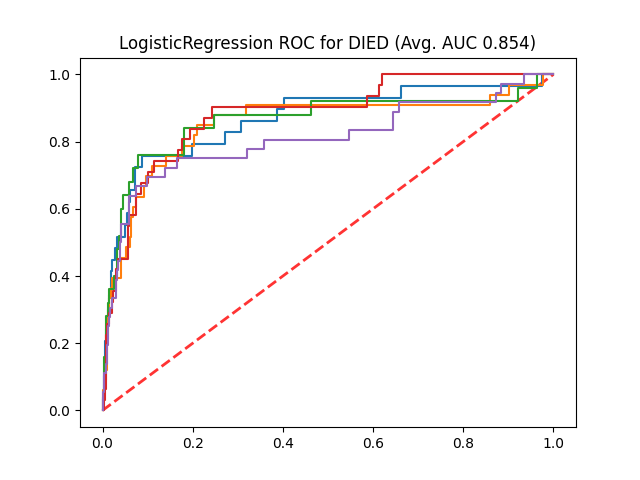
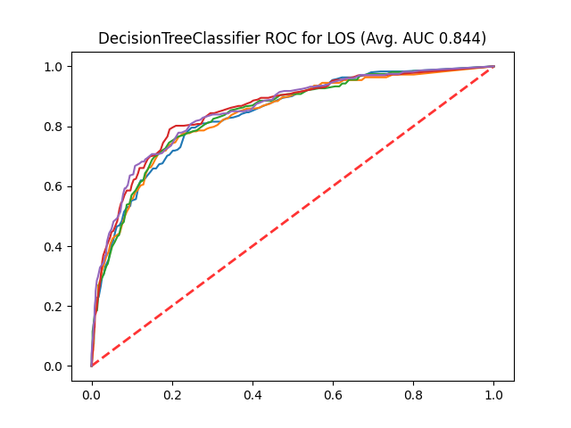
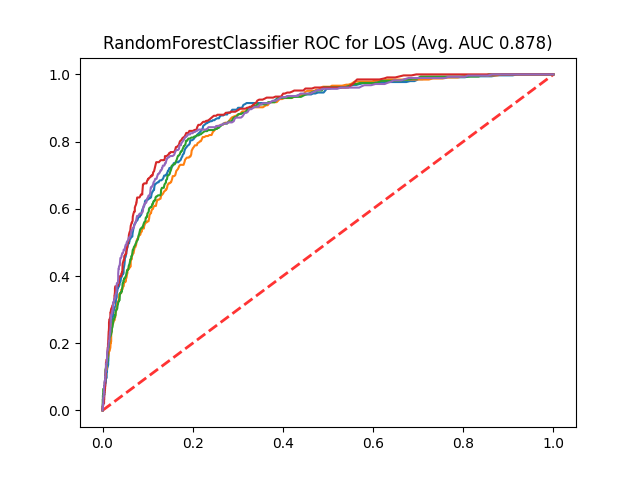
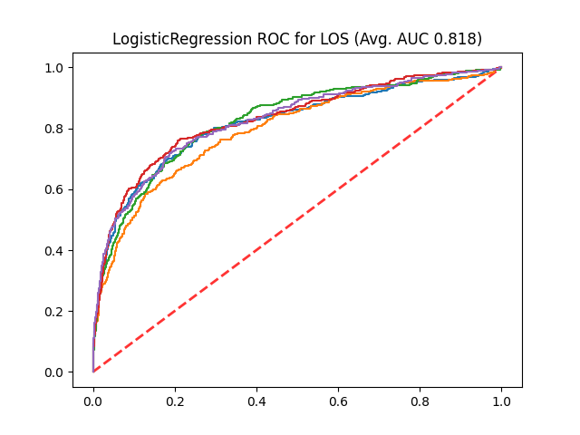
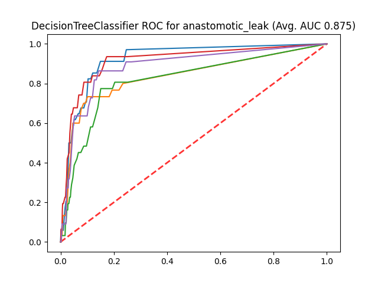
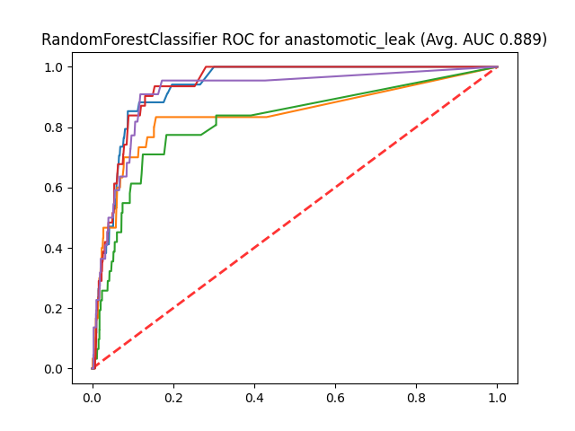
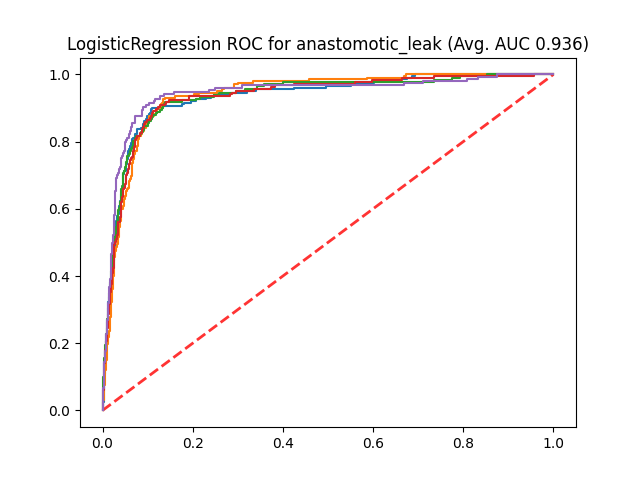

# Results

## Reveiver Operating Characteristic Curves (Laparoscopic Dataset)

### Predicting DIED

| Decision Tree      | Random Forest | Logistic Regression     |
| :---        |    :---  |          :--- |
|       |        |   |

### Predicting LOS

| Decision Tree      | Random Forest | Logistic Regression     |
| :---        |    :---   |          :--- |
|       |        |   |

### Predicting anastomotic_leak

| Decision Tree      | Random Forest | Logistic Regression     |
| :---        |    :---   |          :--- |
|       |        |   |

## Reveiver Operating Characteristic Curves (Open Dataset)

### Predicting DIED

| Decision Tree      | Random Forest | Logistic Regression     |
| :---        |    :---  |          :--- |
|       |        |   |

### Predicting LOS

| Decision Tree      | Random Forest | Logistic Regression     |
| :---        |    :---   |          :--- |
|       |        |   |

### Predicting anastomotic_leak

| Decision Tree      | Random Forest | Logistic Regression     |
| :---        |    :---   |          :--- |
|       |        |   |
