# Results

## Reveiver Operating Characteristic Curves (Laparoscopic Dataset)

### Predicting Inpatient Mortality

| Decision Tree      | Random Forest   | Neural Network |
| :---        |    :---   |  :--- |
| 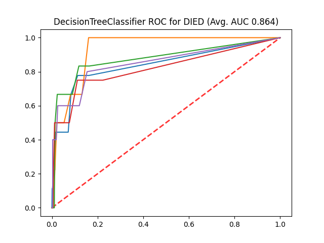      | 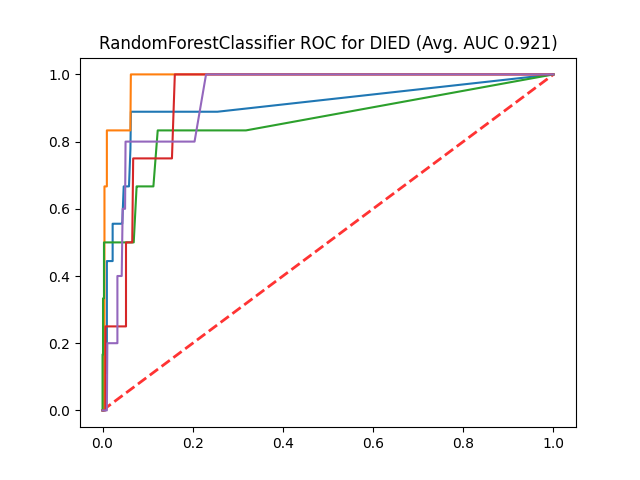       | 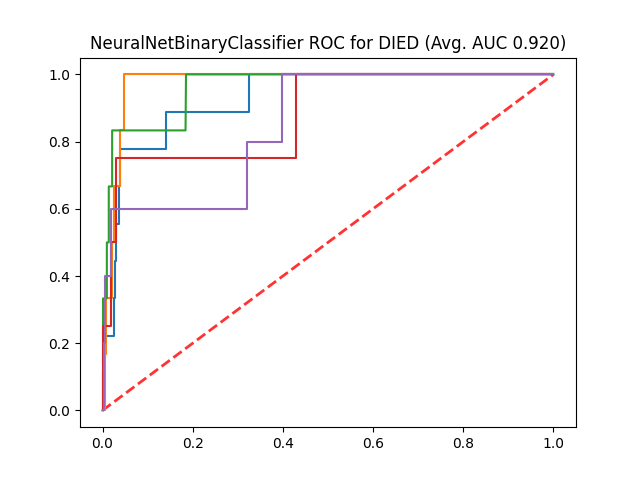  |

### Predicting Length of Stay

| Decision Tree      | Random Forest    | Neural Network                                       |
| :---        |    :---    |:-----------------------------------------------------|
| 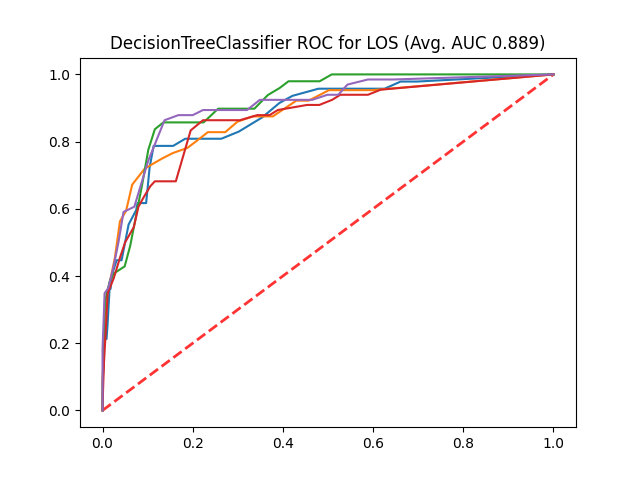      | 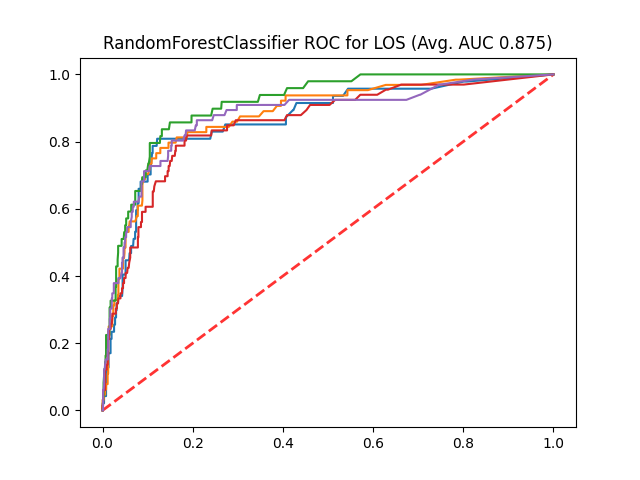       | 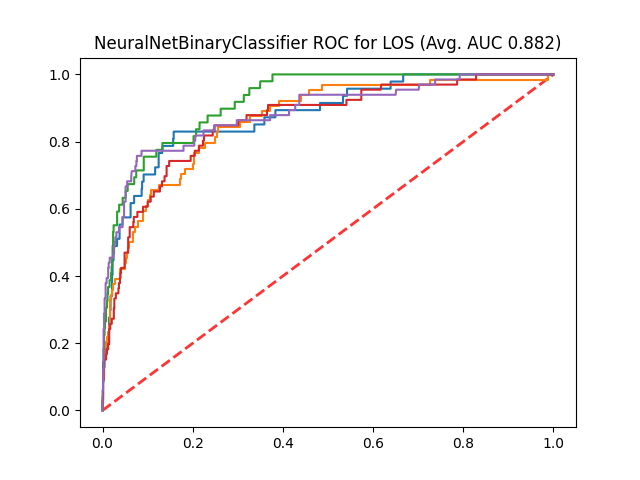  |

### Predicting Anastomotic Leak

| Decision Tree      | Random Forest                                                        | Neural Network                                                     |
| :---        |:---------------------------------------------------------------------|:-------------------------------------------------------------------|
| 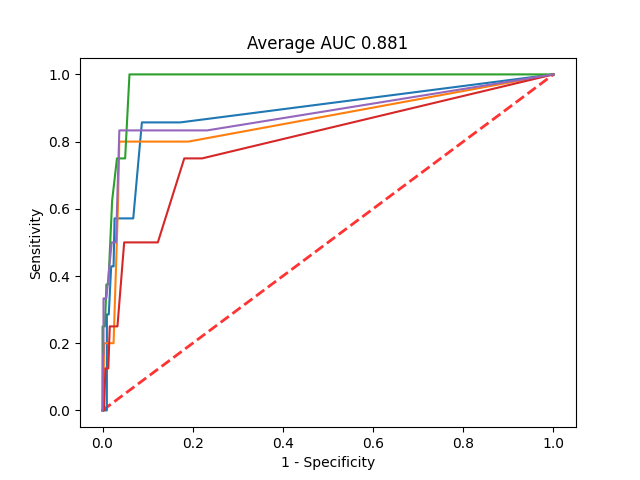      | 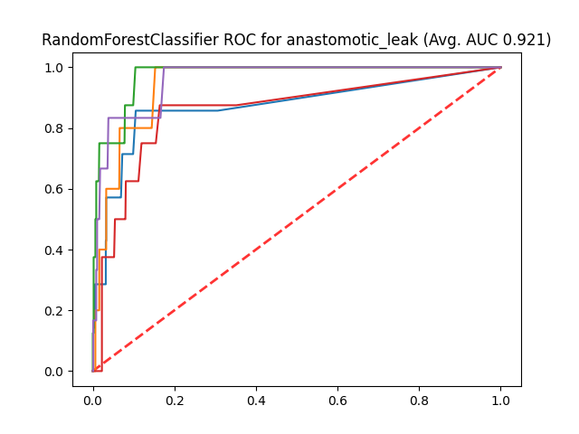      | 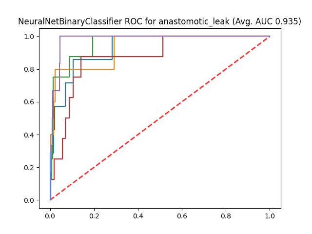 |

## Reveiver Operating Characteristic Curves (Open Dataset)

### Predicting Inpatient Mortality

| Decision Tree      | Random Forest     | Neural Network                                          |
| :---        |    :---  |:--------------------------------------------------------|
| 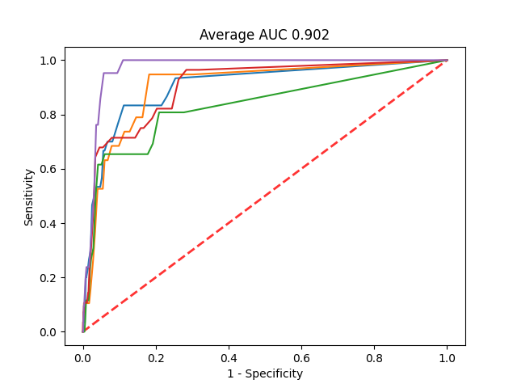      | 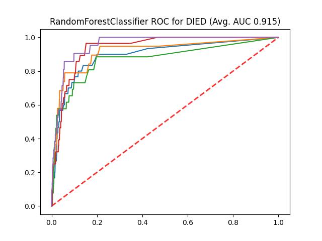       | 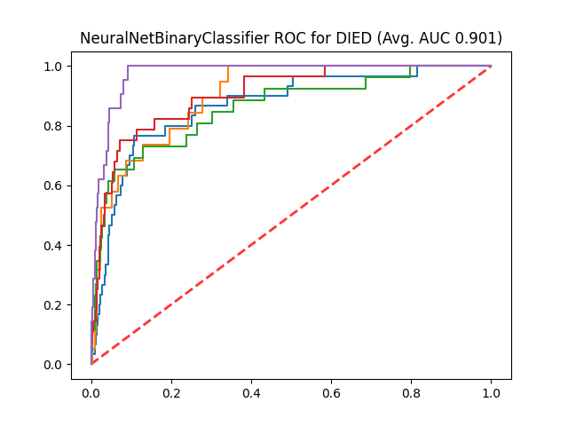 |

### Predicting Length of Stay

| Decision Tree      | Random Forest                                            | Neural Network                                  |
| :---        |:---------------------------------------------------------|:------------------------------------------------|
| 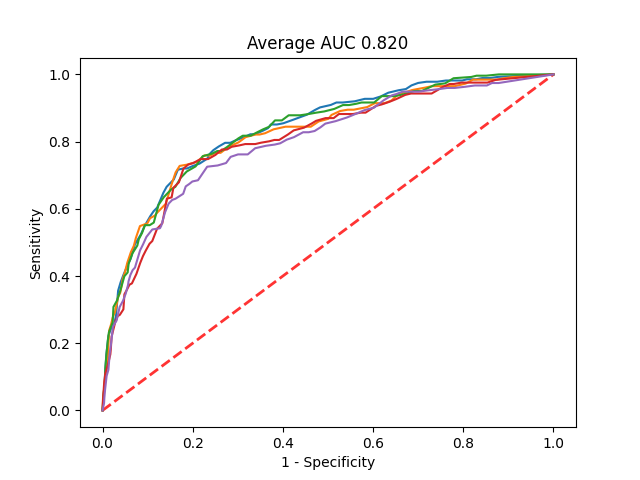      | 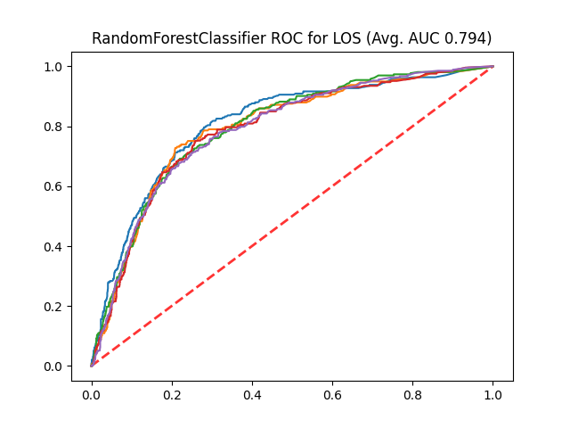      | 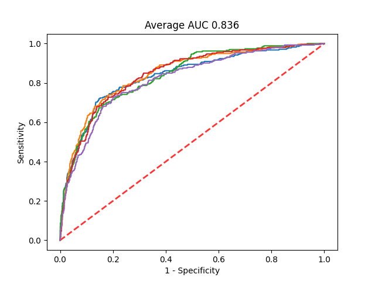 |

### Predicting Anastomotic Leak

| Decision Tree      | Random Forest    | Neural Network                                                      |
| :---        |    :---  |:--------------------------------------------------------------------|
| 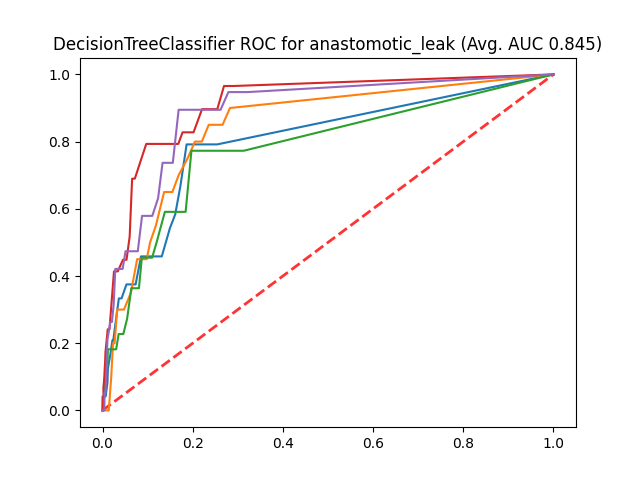      | 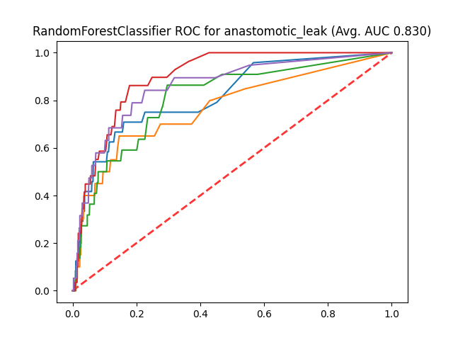       | 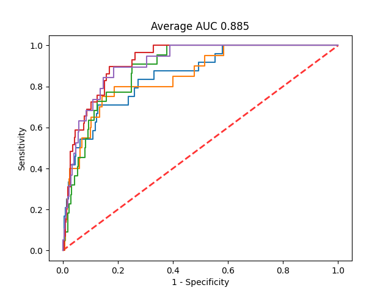  |  |
